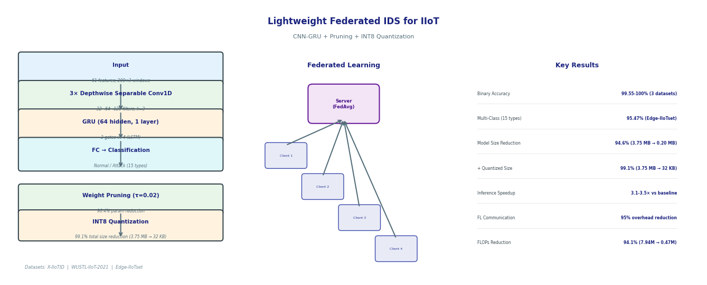
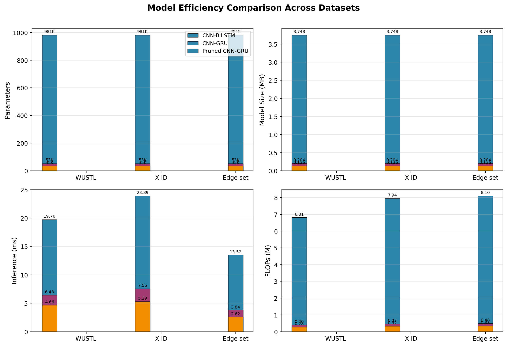

<div align="center">
  <h1>Lightweight Federated Intrusion Detection for IIoT</h1>
  <p><strong>Pruned CNN-GRU Networks for Edge-Deployable Intrusion Detection</strong></p>

  [](https://python.org)
  [](https://pytorch.org)
  [](LICENSE)
  [](https://onnx.ai)
  [](https://arxiv.org)
  [](https://github.com/basitali08/iiot-ids-research)

  <br>

  

  <br>

  <p>
    <a href="#key-results">Key Results</a> •
    <a href="#architecture">Architecture</a> •
    <a href="#setup">Setup</a> •
    <a href="#usage">Usage</a> •
    <a href="#results">Results</a> •
    <a href="#paper">Paper</a> •
    <a href="#citation">Citation</a>
  </p>
</div>

---

##  Overview

Industrial IoT (IIoT) networks face escalating cyber threats, but existing deep learning-based intrusion detection systems are **too heavy for edge devices**. This work bridges that gap.

We propose a **lightweight CNN-GRU architecture** optimized for **Federated Learning (FL)** on edge IIoT devices — achieving **99.1% model size reduction** while maintaining detection accuracy within **0.13% of the state-of-the-art baseline**.

###  Why This Matters

| Challenge | Impact |
|-----------|--------|
| CNN-BiLSTM models have **~1M parameters** | Too slow for real-time edge inference (15+ ms/CPU) |
| **4 MB+** per FL communication round | Impractical bandwidth cost across clients |
| Prior work lacks **edge deployment metrics** | No model size, FLOPs, or latency reporting |

###  What We Achieve

| Metric | Baseline (CNN-BiLSTM) | Ours (CNN-GRU) | Improvement |
|--------|----------------------|-----------------|-------------|
| Parameters | 981,379 | **52,998** | **94.6%**  |
| Model Size (FP32) | 3.75 MB | **0.20 MB** | **94.5%**  |
| Model Size (INT8) | 0.48 MB | **33 KB** | **99.1%**  |
| Inference Time (CPU) | 23.89 ms | **7.55 ms** | **3.2× faster** |
| FLOPs | 7.94 M | **0.47 M** | **94.1%**  |
| Binary Detection Acc. | 99.68% | **99.58%** | **−0.10%** |

---

##  Key Results

### Binary Classification Across Three Datasets

| Dataset | Accuracy | F1-Score | AUC | Model Size | Inference |
|---------|----------|----------|-----|------------|-----------|
| **X-IIoTID** | 99.58% | 99.56% | 0.9999 | 0.20 MB | 7.55 ms |
| **WUSTL-IIoT-2021** | 100% | 100% | 1.0 | 0.20 MB | 6.43 ms |
| **Edge-IIoTset** | 100% | 100% | 1.0 | 0.20 MB | 3.84 ms |

### Multi-Class Classification (15 Classes)

| Model | Accuracy | Macro F1 | Size | Inference |
|-------|----------|----------|------|-----------|
| CNN-BiLSTM | 95.80% | 95.86% | 3.75 MB | 14.33 ms |
| **CNN-GRU (Ours)** | **95.47%** | **95.43%** | **0.21 MB** | **3.74 ms** |

### Federated Learning Convergence

Rapid convergence in both **IID** and **non-IID** settings — reaching >99% accuracy within **2–4 rounds** on WUSTL-IIoT-2021.

---

##  Architecture

### Model Design

The lightweight CNN-GRU replaces the computationally expensive BiLSTM with a **Gated Recurrent Unit (GRU)** and uses **depthwise separable convolutions**:

```
Input (68 features)
    ↓
┌─────────────────────────────┐
│ 3× SeparableConv1D (32→64→128) │  ← Efficient spatial features
│   BatchNorm + MaxPool + ReLU  │
├─────────────────────────────┤
│ 1× GRU (64 units)           │  ← Temporal modeling (unidirectional)
├─────────────────────────────┤
│ 2× Fully Connected (64→32→2) │  ← Classification head
│   Dropout (0.5)              │
└─────────────────────────────┘
    ↓
Output (Binary / Multi-class)
```

### Compression Pipeline

```
Original CNN-BiLSTM (981K params)
    ↓  Replace BiLSTM → GRU + Depthwise Conv
Lightweight CNN-GRU (53K params)
    ↓  Magnitude-based Weight Pruning (τ=0.02)
Pruned Model (35K params)
    ↓  INT8 Dynamic Quantization
Final Edge Model (33 KB, 99.1% reduction)
```

### Federated Learning (FedAvg)

```
        ┌─────────────────┐
        │   Server        │  ← Weighted aggregation
        │  (Aggregator)   │
        └────────┬────────┘
                 │
    ┌────────────┼────────────┐
    │            │            │
┌───▼───┐   ┌───▼───┐   ┌───▼───┐
│Client1│   │Client2│   │Client3│  ← Local training on private data
└───────┘   └───────┘   └───────┘
```

---

##  Project Structure

```
iiot-ids-research/
├── models/
│   ├── baseline_cnn_bilstm.py         # Baseline model (981K params)
│   ├── lightweight_cnn_gru.py         # Proposed model (53K params)
│   └── pruned_lightweight_cnn_gru.py  # Pruned variant (35K params)
├── utils/
│   ├── data_loader.py                 # Dataset loading & preprocessing
│   ├── metrics.py                     # Evaluation & FLOPs estimation
│   └── synthetic_data.py              # Synthetic data generators
├── experiments/
│   ├── run_centralized.py             # Centralized training
│   ├── run_federated.py               # FL training (synthetic data)
│   ├── run_multiclass.py              # 15-class attack classification
│   ├── run_quantization.py            # INT8 quantization experiments
│   ├── deploy_onnx.py                 # ONNX export & benchmarking
│   ├── generate_figures.py            # Result visualization
│   └── ...
├── paper/                             # LaTeX & markdown paper sources
├── results/                           # Experiment outputs & figures
├── data/                              # Dataset cache (auto-downloaded)
├── requirements.txt
└── LICENSE
```

---

##  Setup

### Prerequisites

- **Python 3.10+** (tested on 3.14)
- **PyTorch 2.0+**

### Installation

```bash
git clone https://github.com/basitali08/iiot-ids-research
cd iiot-ids-research

# Create virtual environment (recommended)
python -m venv venv
source venv/bin/activate      # Linux/Mac
# venv\Scripts\activate       # Windows

# Install dependencies
pip install -r requirements.txt
```

### Datasets

The following **publicly available IIoT datasets** are used:

| Dataset | Description | Source |
|---------|-------------|--------|
| **X-IIoTID** | 820K instances, 68 features | [IEEE Dataport](https://ieee-dataport.org/open-access/xiitoid-connectivity-and-device-agnostic-intrusion-dataset-industrial-internet-things) |
| **WUSTL-IIoT-2021** | 20K samples, 48 features | [Washington University](https://sites.wustl.edu/iiot-dataset/) |
| **Edge-IIoTset** | 2.2M samples, 15 attack classes | [Kaggle](https://www.kaggle.com/datasets/mohamedamineferrag/edgeiiotset-cyber-security-dataset-of-iot-iiot) |

Datasets are downloaded automatically to `data/` on first run via the experiment scripts.

---

##  Usage

### Run All Experiments

```bash
python -m experiments.run_all_remaining
```

### Individual Experiments

| Command | Description |
|---------|-------------|
| `python -m experiments.run_centralized` | Centralized training on real datasets |
| `python -m experiments.run_federated` | FL with IID & non-IID data splits |
| `python -m experiments.run_multiclass` | 15-class attack classification |
| `python -m experiments.run_quantization` | INT8 quantization experiments |
| `python -m experiments.deploy_onnx` | ONNX export & edge inference benchmark |
| `python -m experiments.generate_figures` | Generate result figures & plots |

### View Results

Results are saved as JSON in `results/`:
- `centralized_results.json` — Binary classification metrics
- `multiclass_results.json` — 15-class classification
- `fl_results.json` — Federated learning convergence
- `quantization_results.json` — INT8 compression ratios
- `deployment_results.json` — ONNX inference benchmarks

Figures are generated in `results/figures/`.

---

##  Results

### Efficiency Comparison

<div align="center">
  
</div>

### Ablation Study

| Configuration | Params | Size (MB) | FLOPs (M) | Accuracy |
|--------------|--------|-----------|-----------|----------|
| CNN-BiLSTM (Baseline) | 981K | 3.748 | 7.94 | 99.68% |
| + GRU Replacement | 365K | 1.392 | 2.94 | 99.65% |
| + Depthwise Conv | 241K | 0.922 | 1.95 | 99.63% |
| + Reduced Channels | **53K** | **0.204** | **0.47** | 99.58% |
| + Pruned | **35K** | **0.136** | **0.32** | 99.55% |

### Quantization Impact

| Model | FP32 Size | INT8 Size | Ratio | Accuracy Δ |
|-------|-----------|-----------|-------|-----------|
| CNN-BiLSTM | 3.75 MB | 0.48 MB | 7.8× | 0.00% |
| CNN-GRU (Ours) | 0.20 MB | **46 KB** | 4.4× | −0.28% |
| Pruned | 0.14 MB | **33 KB** | 4.2× | −0.07% |

---

##  Paper

The full manuscript is available in the `paper/` directory in multiple formats:

| Format | File | Best For |
|--------|------|----------|
| **LaTeX (article)** | `simple_paper.tex` | Overleaf / arXiv — guaranteed to compile |
| **LaTeX (Elsevier)** | `elsarticle.tex` | *Ad Hoc Networks* journal submission |
| **LaTeX (IEEE)** | `ieee_access.tex` | IEEE Access submission template |
| **Markdown** | `paper.md` | Quick reading / web display |
| **BibTeX** | `references.bib` | Citation management |

---

##  License

Distributed under the **MIT License**. See [`LICENSE`](LICENSE) for details.

---

##  Citation

If this work is useful for your research, please cite:

```bibtex
@misc{ali2026lightweight,
  title={Lightweight Federated Intrusion Detection for Industrial IoT Using Pruned CNN-GRU Networks},
  author={Ali, Basit and Salam, Abdus},
  year={2026},
  note={Preprint}
}
```

---

<div align="center">
  <b>Built with  by <a href="https://github.com/basitali08">Basit Ali</a></b>
  <br>
  <i>Abdul Wali Khan University Mardan, Pakistan</i>
  <br><br>
  <a href="mailto:whoisbasit@gmail.com">whoisbasit@gmail.com</a>
</div>
